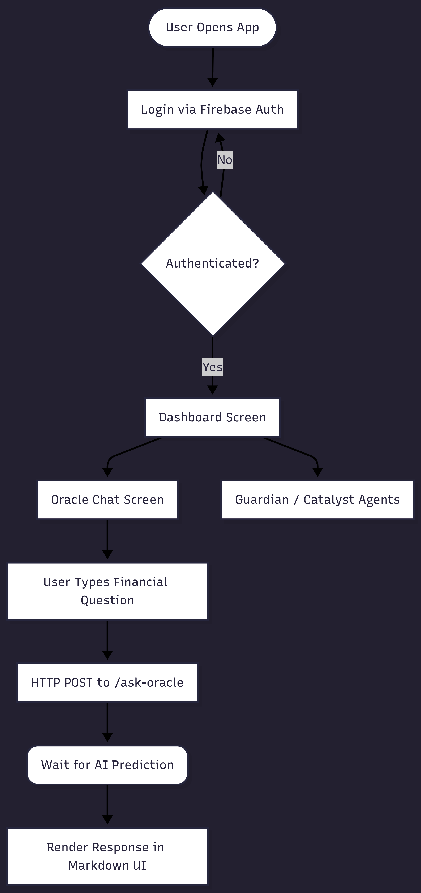
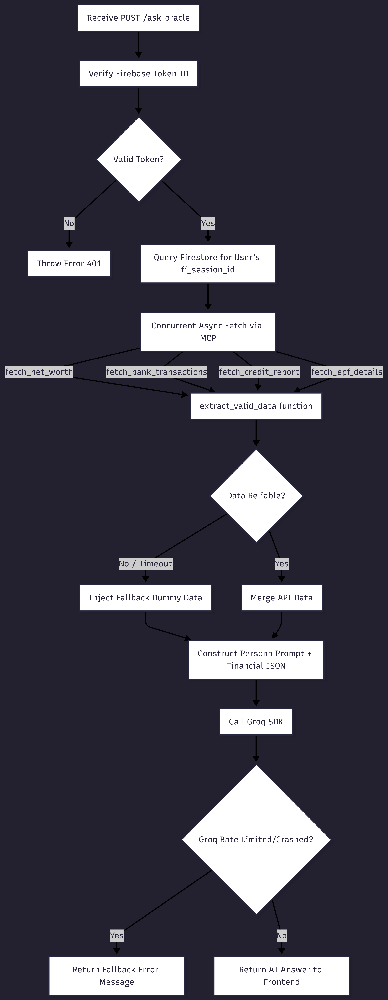
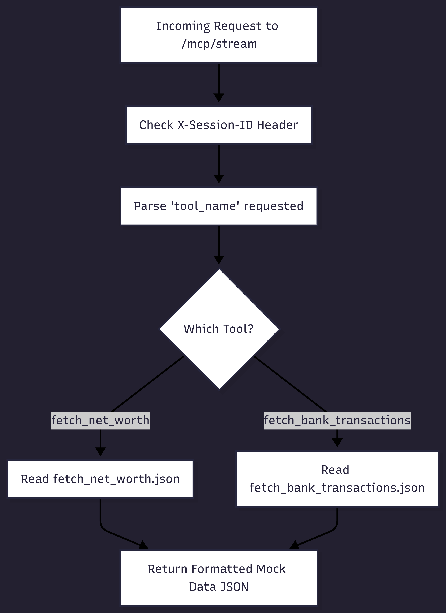

# Invested — AI-Powered Personal Finance Companion

**Invested** is an end-to-end, multi-service personal finance application that acts as your AI-powered financial strategist. It leverages the Model Context Protocol (MCP) to securely fetch your financial data, processes it via Groq-powered LLMs (acting as an Oracle, Guardian, and Catalyst), and streams the beautifully formatted insights straight to a mobile Flutter app.

---

## 🏗️ System Architecture & Data Pipeline

The ecosystem is made up of three primary domains: the Mobile Frontend, the AI Backend, and the Secure Data Server.


---

## 📱 1. Frontend: The Flutter App
The user-facing mobile application where you can track your net worth and directly converse with the Oracle chatbot to ask specific, contextual financial questions. The app parses complex LLM markdown responses into a beautiful native UI.



- **Tech Stack**: Flutter 3.8+, Dart
- **Capabilities**: Firebase Authentication, live Markdown rendering, Real-time agent queries.

---

## 🧠 2. Backend: FastAPI & Groq AI Agents
The brain of the operation. This backend parallel-fetches real-world user snapshots (bank transactions, EPF balances, credit reports) via MCP, builds massive JSON context strings, and delegates natural language queries to Groq's high-speed LLaMA-3 models.



- **Tech Stack**: Python 3.10+, FastAPI, Groq SDK, Firebase Admin.
- **Key Modules**: 
  - `Oracle`: Conversational answers spanning all data.
  - `Guardian`: Security and fraud-alert scanning.
  - `Catalyst`: Investment and growth opportunity analysis.
  - `Strategist`: Market performance cross-referencing.

---

## 🔌 3. Data Source: MCP Mock Server
A standalone Go service that securely mocks a Model Context Protocol server. It validates sessions using phone numbers and returns highly-structured financial data JSONs that the AI models ingest dynamically.



- **Tech Stack**: Go 1.23+
- **Key Endpoints**: `/mockWebPage`, `/login`, `/mcp/stream`

---

## 🚀 Getting Started Locally

### Prerequisites
- Flutter SDK 3.8+
- Python 3.10+
- Go 1.23+
- Your own Groq API Key (`GROQ_API_KEY`)
- Firebase Account Service JSON (`firebase-service-account.json`)

### 1) Start the AI Backend (Port 8000)
This runs the primary FastAPI server that the Flutter app talks to.
```bash
cd backend
python -m venv .venv
source .venv/bin/activate
pip install -r requirements.txt

# Ensure your .env has GROQ_API_KEY and MCP_SERVER_BASE_URL=http://10.0.2.2:8080 (if local)
uvicorn main:app --reload --host 0.0.0.0 --port 8000
```

### 2) Start the Go MCP Server (Port 8080)
```bash
cd fi_mcp_with_backend-main/fi-mcp-dev
go mod tidy
FI_MCP_PORT=8080 go run .
```

### 3) Run the Flutter App
```bash
cd invested
flutter pub get
flutter run
```
*(If you are running on an Android Emulator, ensure your backend API URLs are pointed to `http://10.0.2.2:8000` rather than localhost.)*

---

## 🛡️ Reliability & Fallbacks
If the MCP Mock Server is offline or experiences a timeout, the FastAPI backend will instantly default to an embedded set of "dummy" fallback data (e.g. 1.5 Million INR Net Worth, 790 Credit Score). This ensures the AI agents and dashboard *always* have mock data to respond with, eliminating `unavailable` crashes and delivering a seamless demo experience.

---
